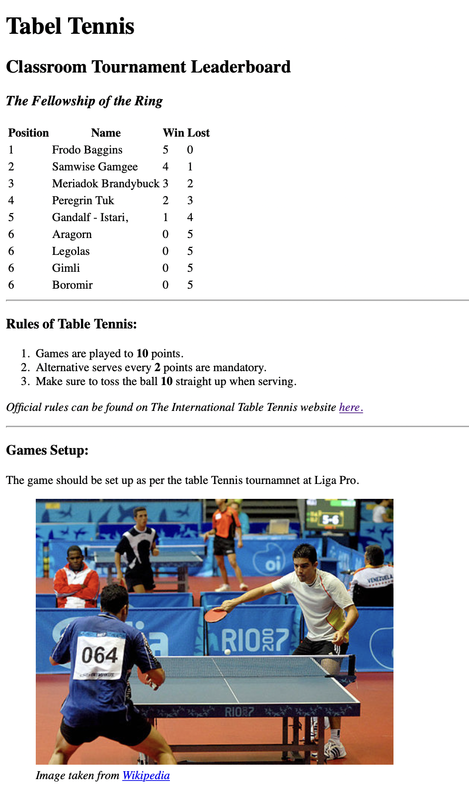

#  🎾 Table tennis project 🎾

## What's it about?

It's a veeery simple webpage built purely in HTML to showcase a Table Tennis tournaments results, by using HTML Table elements and Image elements.

## First look 

## Technologies

+ HTML

## Sources
This little project is part of an amazing Full Stack Developer Course created by 💚 Ania Kubow 💚. Love this women, her sense of humor and ability to explain hard, code-things in a way that I finally understand. 🏆
You can check this course [here](https://www.codewithania.com/about) and I absolutely encourage You to visit her [YouTube](https://www.youtube.com/@AniaKubow) channel 💕.
